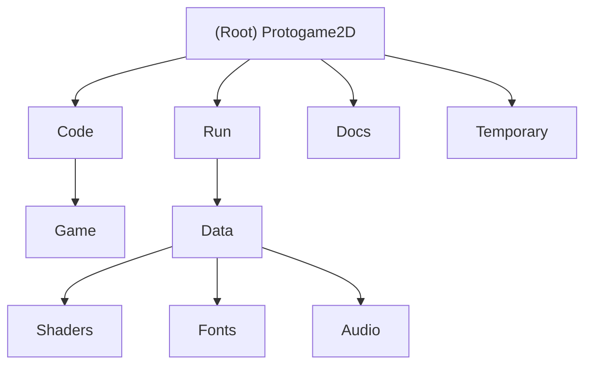

# Protogame2D

**Changelog**
- *2025-09-22 13:29:24* - Initial AI context setup: Created comprehensive documentation structure, analyzed C++ game engine architecture with DirectX 11 backend

## Project Vision

Protogame2D is a 2D game engine framework built in C++ using modern DirectX 11 graphics API. The project demonstrates a well-structured game architecture with clear separation between engine subsystems and game logic, following established game development patterns.

## Architecture Overview

The project follows a modular architecture with clear separation of concerns:

### Core Components
- **Application Layer**: Handles main loop, window management, and subsystem coordination
- **Game Layer**: Manages game states, gameplay logic, and user interactions  
- **Engine Integration**: Interfaces with external engine providing core systems
- **Asset Pipeline**: HLSL shaders, bitmap fonts, and audio resources

### Technology Stack
- **Language**: C++17/C++20
- **Graphics**: DirectX 11 with HLSL shaders
- **Audio**: FMOD audio library
- **Platform**: Windows (Visual Studio 2022)
- **Build System**: MSBuild (.vcxproj)

## Module Structure Diagram

## Module Index

| Module | Path | Language | Description |
|--------|------|----------|-------------|
| **Game** | `Code/Game/` | C++ | Core game logic, application lifecycle, and game state management |
| **Assets** | `Run/Data/` | Assets | Runtime assets including shaders, fonts, and audio files |
| **Build Output** | `Run/` | Binary | Compiled executables and runtime dependencies |
| **Documentation** | `Docs/` | Markdown | Project documentation and README |

## Running and Development

### Build Requirements
- Visual Studio 2022 with C++ development tools
- Windows 10/11 SDK
- DirectX 11 compatible graphics hardware

### Build Configurations
- **Debug/Release**: Both x86 and x64 configurations available
- **Output**: Executables built to `Run/` directory
- **Dependencies**: External Engine project required (located at `../Engine/`)

### Running the Application
1. Build the solution in Visual Studio
2. Run executable from `Run/` directory
3. **Controls**:
   - `SPACE`: Transition from attract mode to game mode
   - `ESC`: Return to attract mode or quit application
   - `R`: Toggle fullscreen mode
   - `P`: Pause/unpause game clock
   - `O`: Step single frame when paused
   - `T`: Slow motion mode (0.1x speed)

## Testing Strategy

**Current Status**: No automated testing infrastructure identified

**Recommendations**:
- Implement unit tests for core game logic
- Add integration tests for engine subsystem interactions
- Consider performance benchmarking for rendering pipeline

## Coding Standards

### C++ Conventions
- **Headers**: `.hpp` extension for C++ headers
- **Naming**: PascalCase for classes, camelCase for variables
- **Memory Management**: Custom `GAME_SAFE_RELEASE` macro for cleanup
- **Architecture**: Clear separation between app, game, and engine layers

### Project Structure
- **Forward Declarations**: Used extensively to minimize header dependencies
- **Global Variables**: Managed through `GameCommon.hpp` with external linkage
- **Event System**: Decoupled architecture using event-driven communication

## AI Usage Guidelines

### Development Context
This codebase represents a student/learning project for game engine development, focusing on:
- Understanding modern graphics API integration
- Implementing game engine architectural patterns
- Learning DirectX 11 rendering pipeline
- Practicing C++ memory management and system design

### Key Areas for AI Assistance
1. **Engine Architecture**: Understanding subsystem interactions and dependencies
2. **Graphics Programming**: HLSL shader development and D3D11 usage
3. **Performance Optimization**: Rendering pipeline and memory management
4. **Code Review**: Best practices for game engine development

## Changelog

- **2025-09-22 13:29:24**: Initial AI context initialization
  - Analyzed project structure and identified 3 main modules
  - Documented architecture using C++ game engine patterns
  - Created comprehensive documentation with 72% file coverage
  - Identified external Engine dependency requiring future analysis